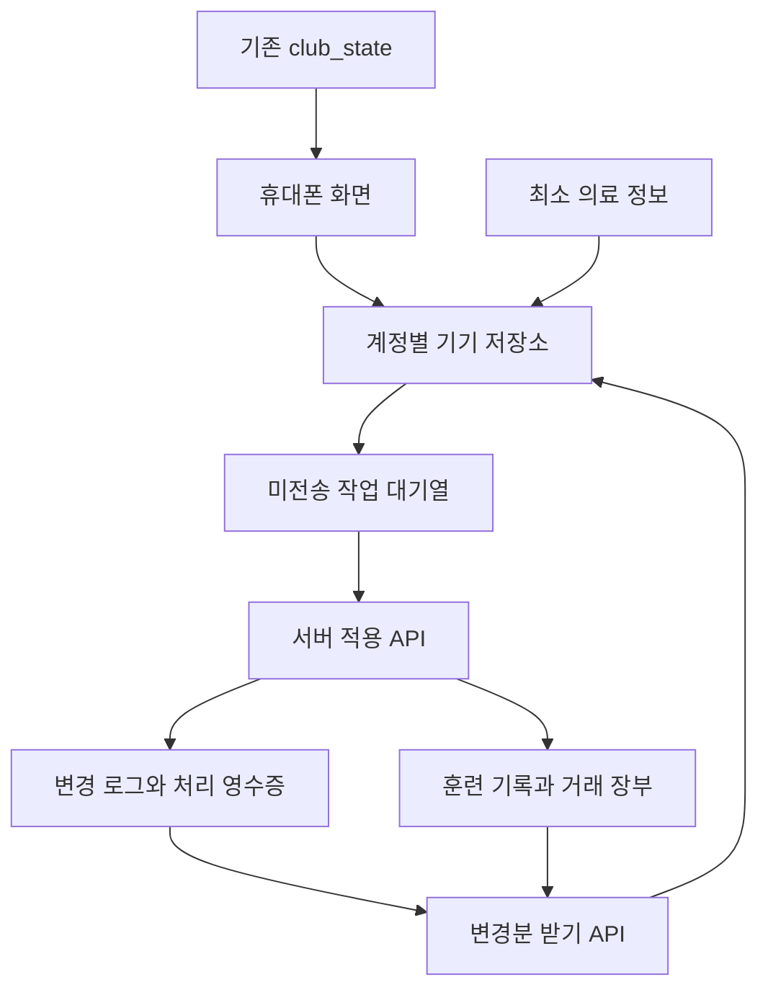

# 치주물루 유나이티드 오프라인 운영 시스템 아키텍처와 이전 설계

작성일: 2026년 10월 2일 · 설계 버전: 1.1 · 기준 코드: [22ac35a](https://github.com/RYUKKANI/Chizumulu-United/tree/22ac35afba2474f20aab72ee1dee15ddf30d710d)

구단주·감독·코치가 휴대폰으로 훈련과 원정 업무를 기록하고, 인터넷이 끊겨도 기록을 보관하며, 연결 후 서로의 변경을 안전하게 합치는 시스템을 설계한다. 원정이 끝난 뒤 입력하는 기록도 지원한다.

이 문서는 운영자 답변과 이전 회의, Claude의 v1.0 검토를 반영한 개발 기준안이다. 현재 정리·개발 담당은 GPT다. 운영자 결정과 기술 구현 기준을 구분하며, 실제 데이터 이전·배포·오프라인 실기기 테스트는 수행하지 않았다.

## 1. 확정된 요구와 개발 범위

| 구분 | 내용 |
| --- | --- |
| 운영자 확정 | 휴대폰 중심으로 사용하며 원정에서는 인터넷이 끊길 수 있다. |
| 운영자 확정 | 구단주뿐 아니라 감독·코치도 입력할 수 있다. 여러 기기의 입력과 원정 후 늦은 입력을 지원한다. |
| 운영자 확정 | 새 저장 구조로 이전하는 것을 허용한다. |
| 운영자 확정 | 실제 비상 연락처·알레르기 등 최소 의료 정보를 기록하고, 최소 정보의 오프라인 사본을 허용한다. |
| 운영자 확정 | 재적 선수의 최소 의료 정보는 승인된 회원 전체가 열람하고 원정용 기기에 보관할 수 있다. |
| 운영자 확정 | 퇴단 선수의 최소 의료 정보는 별도 보관하고 현재 계정과 운영자가 나중에 지정하는 계정만 온라인으로 열람한다. 일반 관리자 권한과 구분한다. |
| 운영자 확정 | 원정 중 인터넷에 전혀 연결되지 않는 기간은 최대 1주 정도를 기준으로 한다. |
| 개발 공통 방향 | 훈련 기록 전체·거래 장부 전체·수당 발생 내역을 별도 테이블로 이전한다. 기존 선수 ID와 백업 참조를 유지한다. |
| 개발 공통 방향 | 서버에서 인증·검증·중복 차단·병합·확정을 처리한다. 기기는 임시 표시와 전송 대기열을 맡는다. |
| 합의 완료 | v1의 회차 생성은 온라인 전용이다. 등록된 회차의 기록 입력은 오프라인에서 허용한다. |

첫 이전 범위는 `training` 행 전체, `operations.finance.transactions` 전체, `operations.finance.allowances` 전체다. 수당 발생 내역은 `allowance_records`로 옮겨 지급·수정·취소를 같은 수당 행의 잠금 아래에서 검증한다. 출석만 분리하거나 원정 지출만 분리하지 않는다. 출석·시간·RPE·메모가 같은 행에 있으며, 잔액과 수당 지급액은 장부 전체로 계산되기 때문이다. [현재 모델](https://github.com/RYUKKANI/Chizumulu-United/blob/22ac35afba2474f20aab72ee1dee15ddf30d710d/operations-model.js#L12)

선수 등록, 회차 생성, 수당 발생 내역 생성·수정·취소와 지급, 의료 정보 수정, 백업 복원은 초기에는 온라인 전용으로 둔다. 의료 정보의 초기 항목은 비상 연락처와 알레르기다. 혈액형·지병·복용약은 이번 결정에 포함하지 않는다.

## 2. 전체 구조와 데이터의 소유권



| 영역 | 확정 데이터를 보관하는 곳 | 초기 처리 |
| --- | --- | --- |
| 선수·일정·명단·설정 | `club_state` | 기존 저장 경로 유지 |
| 훈련 계획 | `club_state.trainingPlans` | 기존 계획 ID 유지, 회차와 명시적으로 연결 |
| 출석 예정·본업 일정 | 기존 `attendancePlans`, `workSchedules` | 실제 훈련 기록과 구분 |
| 실제 훈련 기록 | `training_records` | 한 행의 출석·시간·RPE·메모·기존 종류 정보 전체 이전 |
| 거래 장부 | `ledger_transactions` | 수입·지출·수당 지급·취소 거래 전체 이전 |
| 수당 발생 내역 | `allowance_records` | 기존 ID를 보존해 이전. 생성·수정·취소·지급은 서버 검증 |
| 기초 잔액 | 기존 `club_state` 금융 설정 | 잔액 계산의 출발값으로 유지 |
| 재적 선수의 비상 연락처·알레르기 | `player_medical` | 승인된 회원 전체 열람, 최소 원정 사본 |
| 퇴단 선수의 최소 의료 정보 | `player_medical_archive` | 최종 관리자 전용, 온라인 조회, 일반 상태·백업과 분리 |
| 선수·영수증 사진 | 비공개 Storage | 별도 경량 이미지와 계정별 제한 캐시 |

화면에서는 기존 상태와 새 테이블의 기록을 조합해 사용한다. 조합한 훈련·장부·수당 발생 영역은 기존 전체 저장 요청에 다시 포함하지 않는다. 조회용으로 합친 상태를 그대로 저장하면 두 저장소가 다시 섞인다.

JS 계산식은 당분간 유지할 수 있지만, 지급 가능 여부나 거래의 확정 여부를 판정하는 권한은 서버에 둔다. 이번 구조는 현재 기록 테이블과 변경 로그를 쓰는 동기화 방식이며, 모든 업무를 이벤트 재생으로 복원하는 전체 Event Sourcing 전환은 범위에 포함하지 않는다.

## 3. 테이블과 식별자

공통으로 클럽 범위를 명시한다. 현재 단일 클럽이라도 키·로그·권한 조회는 같은 `club_id`를 사용한다. 기존 선수 식별자 `CU26-###`, 거래 ID, 훈련 기록 ID, 수당 ID와 백업 참조를 보존한다. 새 작업·새 거래에만 UUID를 발급한다.

| 테이블 | 주요 필드와 제약 |
| --- | --- |
| `training_sessions` | 고정 `id`, `club_id`, CAT 기준 `session_date`, `session_no`, 계획 연결·회차 메타데이터, 버전. `UNIQUE(club_id, session_date, session_no)`, 순번은 1 이상. |
| `training_records` | 기존 `id`, `club_id`, `session_id`, `player_id`, 기존 업무 날짜·종류, 출석·시간·RPE·메모, 버전·수정자·서버 수정 시각·삭제 표식. 회차가 지정된 유효 행만 `(club_id, session_id, player_id)` 유일. |
| `ledger_transactions` | 기존 `id`, 업무 날짜, 수입/지출, 금액, 분류·설명, 기존 경기/원정·선수·수당 연결, 결제 수단·거래번호, 취소 여부·취소자·취소 시각, 버전·작성자·수정자. |
| `allowance_records` | 기존 `id`, `club_id`, `player_id`, 업무 날짜, 발생액, 발생 사유, 기존 경기 연결, 취소 상태, 버전·작성자·수정자. 지급 거래는 클럽 범위를 포함한 수당 키를 참조. |
| `player_medical` | 선수별 비상 연락처의 이름·관계·전화, 알레르기 상태와 내용, 정보 출처·확인 날짜, 버전·수정자. 알레르기 미확인과 없음을 구분. |
| `player_medical_archive` | 별도 보관 ID, 선수 ID, 보관된 최소 정보·출처·확인일, 퇴단일·보관 시각·처리자. 최종 관리자 전용. 재적 선수로 돌아와도 자동 공개하지 않음. |
| `medical_archive_access` | 보호된 계정별 특별 열람 권한. 현재 로그인 계정과 운영자가 추후 지정한 계정만 등록. 일반 관리자 승격으로 자동 부여하지 않음. |
| `sync_heads` | 클럽별 현재 `seq`, `sync_epoch`, 쓰기 중지 플래그·전환 revision. 쓰기·최초 사본·전환이 공통으로 사용하는 잠금 대상. |
| `change_log` | 클럽·epoch·seq, 영역·대상 키, 확정 행의 사본 또는 삭제/취소 표식, 버전·서버 시각. 큰 사진과 일반 전체 상태는 넣지 않음. |
| `mutation_receipts` | 클럽·mutationId 유일, 실제 사용자, 정규화한 요청의 해시, 최초 처리 결과. 다른 사용자의 영수증은 반환하지 않음. |

금액은 서버에서 `numeric(18,2)`로 처리하고 작업 JSON과 동기화 응답에서는 소수 문자열로 전달한다. 예: `"2500.00"`. 소수 자릿수·범위·양수 조건을 확인한 뒤 변환하며 지수 표기와 구분용 쉼표는 받지 않는다. 기존 JSON 백업의 숫자는 이전 도구가 정확히 검증해 변환한다. 화면의 입력을 JS Number로 바꿨다가 다시 문자열로 만드는 경로를 지급 판단에 사용하지 않는다. 기존 음수 기초 잔액 허용 여부는 유지한다.

취소 거래를 물리적으로 지우지 않는다. 기존 취소 이력과 수당 연결을 보존한다. 변경 가능한 필드·값·길이·금액 범위는 서버의 허용 목록으로 제한한다.

## 4. 훈련 회차와 기존 기록 연결

표시·공동 식별 키는 CAT 날짜와 순번으로 만든다. 예: `2026-10-02#1`. 서버 내부 회차 ID는 고정하고, 날짜·순번에는 유일 제약을 둔다. 기존 훈련 계획 ID도 바꾸지 않는다. [현재 계획 구조](https://github.com/RYUKKANI/Chizumulu-United/blob/22ac35afba2474f20aab72ee1dee15ddf30d710d/club-workspace.js#L101)

동일 날짜·순번으로 요청이 두 번 와도 같은 회차를 가리키게 할 수 있다. 그러나 키가 같다는 사실만으로 두 사람이 실제로 같은 훈련을 뜻했다고 보장되지는 않는다. 종류·시간 등 회차 정보가 다르면 자동으로 덮어쓰거나 기존 회차로 확정하지 않고 확인 대상으로 남긴다.

**합의 완료:** v1은 온라인에서 회차를 만들고, 미리 내려받은 회차에 오프라인으로 기록한다. 오프라인에서 기본 순번 1의 회차를 자동으로 확정 생성하지 않는다. 후속 후보는 ‘오프라인 임시 회차’를 따로 보관하고, 동기화 시 같은 날짜·번호의 회차가 있으면 사용자가 같은 훈련인지 확인하는 방식이다. 임시 회차의 선수 기록은 회차 연결이 확정된 뒤 전송한다.

이전 규칙:

1. 그 날짜의 기록과 계획을 조사해 회차가 명확한 경우에만 `#1` 등으로 연결한다.

2. 같은 날짜·선수에 여러 행이 있거나 회차를 판별할 수 없으면 `session_id = null`로 남긴다. 행을 합치거나 삭제하지 않는다.

3. 회차 미지정 기록은 기존 기록 ID로 조회·수정하고, 담당자가 나중에 회차를 연결한다.

4. 계획의 날짜를 바꾸더라도 이미 완료한 훈련 기록을 자동 이동하지 않는다.

휴대폰 시각은 작업 순서나 충돌 승자를 결정하는 데 쓰지 않는다. 훈련 업무 날짜는 회차 날짜를, 지출 업무 날짜는 사용자가 선택한 실제 거래 날짜를 따른다. 늦게 입력했다는 이유로 서버 접수 날짜로 바꾸지 않는다. 서버 시각과 기기 시각의 차이는 진단·경고용으로만 사용한다.

## 5. 작업 형식과 충돌 규칙

공통 작업에는 `schemaVersion`, `syncEpoch`, `mutationId`, `ownerUserId`, `kind`, `target`, `clientAt`을 둔다. 훈련 작업에는 `baseRecordExists`와 `baseRecordVersion`을 둔다. 기존 행의 수정은 true와 해당 버전을, 행이 없을 때의 생성은 false와 0을 보낸다. 훈련의 필드 수정에는 변경한 필드의 이전 값 `base`와 새 값 `patch`를 보낸다.

```json
{
  "schemaVersion": 1,
  "syncEpoch": "2a5a4ab4-7c9e-4ce9-b339-743d716d060e",
  "mutationId": "d23ee4b7-7368-4e81-9daa-152b355832ac",
  "ownerUserId": "c946bb8a-706c-4e17-a810-37659b584d66",
  "kind": "training.patch",
  "target": {
    "sessionId": "903f51f5-f124-442b-8e49-24b34dcc0c59",
    "playerId": "CU26-001"
  },
  "baseRecordExists": true,
  "baseRecordVersion": 7,
  "base": { "attendance": "Absent" },
  "patch": { "attendance": "Present" },
  "clientAt": "2026-10-02T08:10:00Z"
}
```

출석 값은 기존 `Present`, `Late`, `Absent`, `Excused`, `Rehab`를 유지한다. 서버의 미기록 값은 null이며 예정 출석과 구분한다. 서버의 작성자는 `auth.uid()`이며, `ownerUserId`는 현재 로그인 사용자와의 일치 확인에만 쓴다. 선택적인 시간차 진단값은 인증·업무 날짜·순번에 영향을 주지 않는다.

| 작업 | 처리 기준 |
| --- | --- |
| `training.patch` | 회차·선수 조합 또는 기존 기록 ID로 대상 결정. 출석·시간·RPE·메모 등 허용된 필드를 비교해 적용. 새 행은 명시한 행 없음 표시와 v1의 고정 기본값으로 비교해 생성. |
| `ledger.add` | 새 거래 ID와 mutationId로 중복 차단. 일반 수입·지출 추가는 오프라인 허용. |
| `ledger.update` / `ledger.void` | 대상 기록 버전 일치 필요. 금액·연결 관계·취소 규칙을 행 전체 기준으로 검증. |
| `allowance.add` / `allowance.update` / `allowance.void` | 초기 온라인 전용. 수정·취소는 기록 버전과 유효 지급 합계를 확인. |
| `allowance.pay` | 초기 온라인 전용. 서버가 미지급액을 다시 확인한 뒤 같은 장부에 한 번만 기록. |
| `medical.update` | 온라인 전용의 별도 의료 API. 승인된 재적 선수 정보만 수정하며 일반 대기열·로그·백업에 내용이 섞이지 않음. |
| `training.delete` | 대상 기록 버전 검증 후 삭제 표식과 변경 로그를 저장. 일반 조회·집계에서 제외하고 다른 기기에도 전달. 초기 온라인 전용. |
| 회차 연결·구조 변경 | 초기 온라인 전용. 단순 출석 필드 병합으로 처리하지 않음. |

**새 행의 기준:** 생성 요청은 `baseRecordExists:false`, `baseRecordVersion:0`, `base:{}`를 보낸다. 서버는 변경 필드의 이전 값을 schemaVersion 1의 고정 기본값으로 해석한다. 기본값은 출석=null, 시간=0, RPE=null, 메모="", 종류=null이다. 종류·메모 등의 자동 입력값이 필요하면 patch에 명시한다. 동기화 시점의 회차 설정이나 화면 기본값을 과거 base로 대신 사용하지 않는다. 기존 빈 RPE 문자열은 조회·이전 시 null로 정규화한다.

행이 실제로 없으면 이 기준에 patch를 적용해 version 1로 만든다. 다른 기기가 먼저 같은 회차·선수 행을 만들었으면 현재 행과 고정 기본값을 필드별로 비교한다. 먼저 출석 Present가 저장된 뒤 같은 생성 작업이 Present를 보내면 `changed:false`, Absent를 보내면 충돌이다. RPE만 바꾼 다른 생성 작업은 RPE의 이전 값과 비교해 합칠 수 있다. 삭제 표식이 있거나 기존 행 수정 요청의 대상이 사라졌으면 자동 재생성하지 않고 확인 필요 결과를 돌려준다.

훈련 필드의 병합은 다음과 같다.

| 서버 현재 값 | 결과 |
| --- | --- |
| 이전 값과 같음 | 새 값을 적용 |
| 새 값과 같음 | 이미 원하는 값이므로 해당 필드는 변경하지 않음 |
| 이전 값·새 값과 모두 다름 | 충돌로 반환 |

이 규칙은 출석과 RPE를 서로 다른 사람이 수정하는 경우를 합친다. 버전이 달라도 변경 필드가 충돌하지 않으면 적용할 수 있다. 단, 한 작업에 충돌 필드가 하나라도 있으면 그 작업 전체를 적용하지 않는다. 일부 필드만 적용한 뒤 대기열에서 전체 작업을 지우지 않는다. 병합 후 행 전체의 유효성도 검사한다.

금융 수정에 이 규칙을 그대로 적용하지 않는다. 수당 연결·금액·취소는 서로 영향을 주므로 기록 버전과 금융 규칙으로 검증한다. 누락한 필드는 수정하지 않으며, 명시적 `null`은 값 비우기 요청과 구분해 검증한다.

값이 모두 같으면 `applied, changed:false`로 응답하고 영수증을 저장한다. 실제 변경이 없으면 기록 버전과 변경 순번을 올리지 않는다. 같은 mutationId에 다른 내용을 보내면 `MUTATION_ID_REUSED`로 거절한다.

## 6. 서버 API와 트랜잭션

### 전송: apply_club_actions

v1부터 `p_actions` 배열을 받는다. 최대 50건이며 전체 요청 크기 제한도 둔다. 크기 제한의 초기 권고는 256 KiB다. 사진 원본은 이 요청에 포함하지 않는다. 기기에서 만든 순서를 유지하고, 같은 대상의 선행 미확정 작업은 의존 관계를 해결한 뒤 보낸다.

| status | 응답 내용 | 기기의 처리 |
| --- | --- | --- |
| `applied` | mutationId, changed, 확정 행·version, serverAt, 변경 시 seq | 확인 결과를 기기에 먼저 저장하고 해당 작업을 제거 |
| `duplicate` | 같은 사용자·같은 내용으로 이미 성공한 최초 결과 `originalResult` | 성공으로 확인. 원래 결과가 오래된 버전이면 현재 화면을 되돌리지 않고 변경분 받기로 최신화 |
| `conflict` | 현재 행·버전·수정자·시각, 충돌 필드, 오류 코드 | 충돌 목록으로 이동. 사용자가 선택한 결과는 새 mutationId와 현재 기준값으로 전송 |
| `rejected` | 형식·권한·대상·불변 규칙 관련 오류 코드 | 확인 필요 목록으로 이동. 자동 재시도 중단 |

실패한 최초 결과를 재사용할 경우에는 원래 `conflict` 또는 `rejected` 상태를 유지한다. `duplicate`를 실패 처리의 성공 표시로 쓰지 않는다. 사용자가 내용을 바꾸거나 권한을 회복한 뒤 재요청하려면 새 mutationId를 사용한다.

호출마다 현재 승인 상태를 다시 확인하고, 요청의 syncEpoch가 현재 기준과 다르면 `EPOCH_MISMATCH`로 적용을 거절한다. 결과를 반환하기 전에 기록 변경·로그·영수증을 함께 저장한다. 예상 가능한 업무 오류는 해당 작업만 되돌리고 나머지 작업의 결과를 돌려준다. 예상하지 못한 DB 오류는 호출 전체를 실패시킨다. PostgREST의 한 호출은 하나의 바깥 트랜잭션이므로, 작업별 예외 블록을 독립 커밋으로 설명하지 않는다. [PostgREST 트랜잭션](https://docs.postgrest.org/en/stable/references/transactions.html), [PostgreSQL 예외 처리](https://www.postgresql.org/docs/current/plpgsql-control-structures.html)

네트워크 오류·시간 초과·5xx로 결과를 못 받으면 전송한 모든 작업을 그대로 유지하고 같은 mutationId로 재시도한다. 401은 세션 갱신을 시도하고, 계속 실패하면 로그인을 안내하며 대기열을 유지한다. 승인 취소는 동기화를 중단한다.

### 순번과 잠금

`sync_heads`의 클럽 행을 잠근 상태에서 순번을 발급하고, 호출이 확정될 때까지 잠금을 유지한다. 단순 자동 증가 번호만 사용하면 번호가 먼저 발급된 트랜잭션이 늦게 확정되어 커서 이후 조회에서 빠질 수 있다. [시퀀스 동작](https://www.postgresql.org/docs/current/functions-sequence.html), [행 잠금](https://www.postgresql.org/docs/current/explicit-locking.html)

공통 잠금 순서는 **순번 카운터 → 필요 시 club_state → 수당 행의 ID 순서 → 장부·그 밖의 대상 행의 고정 순서**다. 수당 지급·수정·취소와 지급 거래 취소가 모두 같은 수당 행을 잠근다. 이전 도구·복원·쓰기를 중지하는 작업도 순번 카운터의 FOR UPDATE 잠금을 먼저 얻는다. 긴 작업·사진 업로드는 잠금을 쥔 채 수행하지 않는다.

### 받기: pull_club_changes

요청은 `p_after_seq`, `p_sync_epoch`, 페이지 크기를 받는다. 응답은 `changes`, `nextCursor`, `hasMore`, `syncEpoch`이며 현재 헤드 `latestSeq`는 참고값으로만 제공한다. 순번은 큰 정수를 안전하게 다루도록 JSON에서 십진 문자열로 전달한다.

페이지에 받은 변경과 nextCursor를 **하나의 IndexedDB 트랜잭션**으로 저장한다. 중간 종료되면 둘 다 반영되거나 둘 다 미반영되어야 한다. 전송 응답의 seq나 latestSeq만 보고 다운로드 커서를 건너뛰지 않는다. 실제 읽고 저장한 페이지까지만 전진한다.

### 최초 사본 get_club_snapshot

인증과 클럽 접근 권한을 확인한 뒤, 데이터 읽기를 시작하기 전에 `sync_heads`의 해당 클럽 행을 `FOR SHARE`로 잠근다. 잠금을 얻은 다음 순번·epoch·일반 상태·회차·훈련·장부·수당을 읽고 한 응답으로 반환한다. 모든 관련 쓰기는 같은 헤드 행을 `FOR UPDATE`로 잠그므로, 읽는 동안 확정 데이터가 바뀌지 않는다. `save_club_state`·의료 보관 전환·이전 도구·백업 복원도 이 규칙을 따른다. 헤드 행이 없으면 초기화 오류로 처리하며 잠금 없는 사본을 반환하지 않는다.

이는 READ COMMITTED 전체를 같은 MVCC 스냅샷으로 바꾸는 방법이 아니라, 관련 쓰기를 잠시 막아 행과 커서가 일관되게 읽히도록 하는 프로토콜이다. 기본 격리 수준에서는 문장마다 읽기 기준이 달라질 수 있다. [PostgreSQL 격리 수준](https://www.postgresql.org/docs/current/transaction-iso.html), [공유·배타 행 잠금](https://www.postgresql.org/docs/current/explicit-locking.html)

행 잠금은 읽기 전용 호출에서 사용할 수 없으므로 사본 RPC는 POST로 호출하고 VOLATILE로 선언한다. 필요한 잠금 권한은 제한된 definer 함수 안에서 제공하며 함수 자체에서 승인·클럽 접근을 검사한다. GET/STABLE 조합으로 배포하지 않는다. [PostgREST 호출과 접근 모드](https://docs.postgrest.org/en/stable/references/transactions.html)

사본을 여러 HTTP 요청으로 나눌 경우 요청 사이에 잠금이 유지된다고 가정하지 않는다. v1은 작은 운영 사본을 한 RPC에서 만든다. 규모가 커지면 잠금 아래에서 고정 사본을 만들고 그 사본 토큰으로 페이지를 받는 방식으로 확장한다. 의료 내용은 승인된 재적 선수 범위의 별도 허용 목록으로 받으며 일반 동기화 로그에는 넣지 않는다.

로그 보존 범위를 벗어나거나 epoch가 다르면 `RESYNC_REQUIRED`를 반환하고 새 사본을 받는다. 이때 미전송 작업은 별도로 보존하고 새 사본 위에서 검토한다.

일반 순서는 보내기 → 받기다. 일부 충돌·거절이 남아도 다른 기록의 받기는 계속한다. 의료 변경은 권한을 적용한 별도 조회·캐시 경로로 처리하며 일반 변경 로그에 의료 내용을 넣지 않는다.

## 7. 기기 저장과 동기화 동작

IndexedDB는 서버에서 확인한 사본, 미전송 작업, 충돌·확인 필요 작업, 회차·원정 준비 정보와 최소 의료 사본을 구분한다. 저장소 키는 서버 프로젝트·클럽·계정별로 나눈다. 기존 복구 저장소도 이미 계정별 키를 사용한다. [현재 복구 경로](https://github.com/RYUKKANI/Chizumulu-United/blob/22ac35afba2474f20aab72ee1dee15ddf30d710d/membership.js#L122)

앱 화면 파일은 서비스 워커로 보관한다. 마지막 확인 사본을 별도로 저장해, 인터넷이 끊긴 상태에서 앱을 다시 열어도 조회와 허용된 기록 입력이 가능하게 한다. 캐시 없는 첫 접속·새 계정 로그인은 온라인이 필요하다. 설치 기능을 위한 매니페스트만 추가해서 오프라인 준비가 끝났다고 표시하지 않는다.

기기 저장이 완료된 뒤에만 “기기에 저장됨”을 표시한다. 전송 대기열이 0이어도 마지막 받기가 실패했다면 “구단 공유 완료”로 표시하지 않는다. 미전송·충돌·확인 필요 건수와 마지막 성공 동기화 시각을 따로 표시한다.

전송 전 한 번도 시도하지 않은 같은 대상의 수정은 묶을 수 있다. 처음 수정하기 전 base와 마지막 새 값을 유지한다. 한 번이라도 전송을 시도한 작업은 내용과 mutationId를 고정한다. 이후 수정은 별도 작업으로 보관하고 선행 결과를 받은 뒤 기준값을 정한다. 전송 중 작업 내용을 바꾸면 멱등성이 깨진다.

재시도는 앱 시작, 화면 복귀, online 이벤트, 수동 동기화, 대기열이 있을 때의 주기 재시도로 시작한다. 실제 동기화 요청에 시간 제한·지수 백오프·무작위 지연을 적용하고 최대 간격의 초기 권고는 5분이다. 추가 핑을 반복하지 않는다.

현재 코드에도 online 이벤트 전송은 있다. 보완 대상은 연결된 것으로 보이지만 서버에 닿지 않는 경우와 화면 복귀 시의 미전송 처리다. [기존 online 처리](https://github.com/RYUKKANI/Chizumulu-United/blob/22ac35afba2474f20aab72ee1dee15ddf30d710d/membership.js#L252)

브라우저의 연결 표시는 서버 접속 성공을 보장하지 않으며, 화면이 숨겨지거나 앱이 닫히면 재시도가 멈추거나 지연될 수 있다. Background Sync는 지원되는 기기의 보조 기능으로만 쓴다. 화면에는 “앱을 열면 다시 전송합니다”라고 안내한다. [연결 상태의 한계](https://developer.mozilla.org/en-US/docs/Web/API/Navigator/onLine), [백그라운드 제한](https://developer.mozilla.org/en-US/docs/Web/API/Page_Visibility_API)

로그아웃 선택지는 취소, 지금 동기화, 로컬 운영 기록 백업, 같은 계정용 미전송 보관을 제공한다. 영구 폐기는 별도 명시 선택으로 둔다. 로그아웃 시 조회 사본·사진 캐시·최소 의료 사본을 삭제한다. 보관한 대기열은 다른 계정에서 조회하거나 전송하지 못하게 한다. 의료 내용은 일반 로컬 백업과 일반 대기열 보관에서 제외한다.

### 앱 업데이트와 작업 형식 호환

새 앱 파일은 먼저 받아 준비하되 입력 중·전송 중인 화면을 자동 새로고침하지 않는다. 업데이트는 안전한 재실행 시 적용하고 IndexedDB의 사본·대기열을 먼저 읽는다. 앱 파일 버전과 작업 schemaVersion은 별개로 관리한다.

최대 1주 오프라인 사용을 고려해, 작업 형식의 지원 종료를 알린 뒤 최소 14일 동안 그 형식의 수신과 최초 결과 조회를 유지한다. 이는 GPT의 초기 기술 기본값이다. 앱을 여러 번 배포했더라도 지원 기간이 남은 형식은 모두 받으며 단순히 현재·직전 두 버전만 지원하지 않는다. 보안상 수신을 중단해야 해도 작업과 원문은 기기에 남긴다.

아직 한 번도 전송하지 않은 작업만 새 형식으로 변환할 수 있다. 전송을 시도한 작업은 내용·schemaVersion·mutationId를 고정한다. 이미 서버에 반영됐을 수 있으므로 새 ID로 복제하지 않는다. 구형 작업은 원형 그대로 처리하거나 최초 결과를 먼저 조회한다. 영수증 요청 해시는 원래 형식의 요청을 기준으로 비교한 뒤 내부 처리 형식으로 변환한다.

지원 종료 오류·업데이트 필요 오류·MAINTENANCE는 대기열 삭제 사유가 아니다. 지원 종료는 확인 필요 상태로 보존하고 백업·업데이트·재처리 경로를 안내한다. MAINTENANCE는 일시 보류로 두고 해제 뒤 재시도한다. IndexedDB 구조 변경도 원본을 보존한 상태에서 원자적으로 변환하고 실패하면 원본을 지우지 않는다.

## 8. 장부·수당·중복 의심과 의료 정보

### 장부와 수당

기초 잔액에 새 장부의 유효 수입·지출을 한 번씩 합산한다. 수당 지급은 새 장부의 expense 거래 한 건으로 계산한다. 수당 발생 내역을 별도 지출로 다시 더하지 않는다. [기존 계산과 지급 규칙](https://github.com/RYUKKANI/Chizumulu-United/blob/22ac35afba2474f20aab72ee1dee15ddf30d710d/operations-model.js#L12)

수당 지급·발생액 수정·취소는 `allowance_records`의 같은 행을 잠근 상태에서 유효 지급 합계를 확인한다. 발생액보다 많이 지급하지 못하고, 지급액 아래로 발생액을 줄이지 못하며, 이미 지급한 수당의 선수를 바꾸거나 유효 지급이 남은 수당을 취소하지 못한다. 지급 거래를 취소할 때도 해당 수당 행을 먼저 잠근다. 기존 `save_club_state`는 수당 JSON 비교·지급 검증을 맡지 않으며 이전된 수당 영역의 쓰기를 명시적으로 거부한다. [현재 금융 편집 규칙](https://github.com/RYUKKANI/Chizumulu-United/blob/22ac35afba2474f20aab72ee1dee15ddf30d710d/operations.js#L65)

결제 수단은 현금·Airtel Money·TNM Mpamba·은행·기타·미기재를 초기 선택지로 제안한다. 기존 기록의 미기재를 자동으로 현금으로 바꾸지 않는다. 거래번호와 영수증 첨부는 선택 사항이다. 사진 업로드가 늦어져도 지출 금액 기록은 먼저 저장한다.

거래번호가 같은 기록, 또는 같은 원정·업무 날짜·금액·분류의 현금 기록은 중복 의심 배지로 표시한다. 실제 같은 금액을 두 번 쓸 수 있으므로 자동 병합·삭제·저장 차단은 하지 않는다. 통신 재전송 중복과 사람이 다시 입력한 중복 의심을 구분한다.

### 최소 의료 정보

비상 연락처와 알레르기는 별도 테이블에 저장한다. 재적 선수의 정보는 승인된 회원 전체가 열람하고 원정 사본을 보관한다. 입력은 기존 승인 회원 편집 정책을 따르되 온라인에서만 허용하고 변경자·확인 날짜를 기록한다. 퇴단 선수의 정보는 최종 관리자 전용 보관 테이블로 이동한다.

일반 `club_state`, 일반 장부 로그, 일반 JSON 백업에는 의료 내용을 넣지 않는다. 승인 회원의 열람 허용을 일반 백업 파일에 의료 정보를 자동 포함하라는 지시로 해석하지 않는다. 별도 의료 내보내기는 명시적인 기능과 권한 검토를 거쳐 도입한다.

원정 준비 시 선택한 재적 선수의 최소 사본만 계정별로 보관하고 마지막 확인 시각을 표시한다. 예상 오프라인 기간은 최대 1주다. 출발 전 권한과 사본을 갱신하고 기간이 지난 사본에는 갱신 안내를 표시한다. 로그아웃·원정 사본 해제 시 삭제한다.

방출·이적 등 구단 이탈이 확정되면 헤드 잠금 아래에서 의료 내용을 `player_medical_archive`로 이동하고 재적 의료 테이블에서는 제거한다. 이탈 상태 변경과 정보 이동은 같은 트랜잭션에서 처리한다. 자동 삭제 기간을 두지 않고 별도 보관한다. 부상·재활·선발 제외를 구단 이탈로 처리하지 않는다. 보관 정보는 최종 관리자 전용 권한으로 온라인에서만 조회하고 일반 승인 회원·원정 사본·일반 백업에는 제공하지 않는다. 재입단해도 보관 정보를 자동 공개하지 않고 최신 정보를 확인한 뒤 재적 정보를 다시 등록한다.

최종 관리자 열람 권한은 현재 로그인 계정과 운영자가 나중에 지정하는 계정에만 부여한다. 일반 관리자라는 이유로 자동 부여하지 않는다. 실제 구현 시 로그인 계정의 사용자 ID를 확인해 보호된 권한 목록에 등록하며 표시 이름이나 클라이언트가 보낸 관리자 플래그를 신뢰하지 않는다. 특별 권한의 추가·회수는 운영자의 명시적 지정에 따른다.

다시 연결한 기기는 승인 상태와 재적 선수 허용 목록을 먼저 확인하고 퇴단 선수의 의료 사본을 제거한 뒤 의료 화면에 보여준다. 삭제·제외 안내에는 의료 내용이 들어가지 않는다. 이미 오프라인인 기기의 사본을 서버가 즉시 없앨 수는 없으며 다음 연결 또는 해당 기기의 로그아웃·사본 해제 시 정리한다.

공개 스키마의 모든 새 테이블에 RLS를 적용한다. 일반 회원의 테이블 직접 쓰기는 막고 검증 API를 통해 확정한다. 일반 읽기 함수는 호출자 권한과 RLS를 따르며, 헤드 행의 공유 잠금이 필요한 최초 사본과 특별 권한 조회는 제한된 definer 함수에서 접근을 다시 검사한다. 직접 쓰기를 막고 검증 API에만 쓰기를 허용하는 적용 함수는 definer 방식으로 구현하되, 함수 안에서 현재 승인·클럽·사용자를 반드시 검사한다. 고정 search_path를 사용하고 PUBLIC·anon의 EXECUTE를 회수해 필요한 authenticated 호출만 허용한다. service_role 키는 프런트엔드에 두지 않는다. [Supabase 함수 보안](https://supabase.com/docs/guides/database/functions)

사진은 비공개 버킷에 두고 권한을 검사한다. 서명 URL의 만료와 기기에 내려받은 이미지의 삭제는 별개다. 이미지 캐시는 무기한 보관하지 않고 용량·버전·삭제 규칙을 둔다. [비공개 Storage](https://supabase.com/docs/guides/storage/buckets/fundamentals)

## 9. 데이터 이전과 기존 앱 호환

1. **원본 보존과 전환 준비:** 이전 전 전체 상태와 기준 revision을 보관한다. 구단 원정이 없는 기간을 선택하고 입력에 사용하는 계정과 기기 목록을 확인한다. 서버만으로 오프라인 대기열이 0임을 증명할 수 없으므로 각 기기를 연결해 미전송 0건과 마지막 성공 동기화를 확인한다. 실제 운영 데이터로 충돌 실험을 하지 않는다.

2. **새 구조 생성:** 테이블·인덱스·RLS·API·동기화 epoch를 준비한다. 개발 환경에서 먼저 검증한다.

3. **변환 점검:** 훈련·거래·수당 발생 내역의 기존 ID, 연결, 취소 상태를 보존해 시험 변환한다. 회차가 불명확한 훈련은 미지정으로 남긴다. 사진 이전은 별도 작업으로 진행한다.

4. **대조:** 훈련·거래·수당 발생 내역의 건수, 유효 수입·지출·잔액, 선수별 수당 발생액·지급액·미지급액, 취소 건수와 기존 백업을 비교한다. 이상한 금액·참조·날짜를 조용히 보정하지 않고 목록으로 남긴다.

5. **클라이언트 준비:** 새 화면은 두 저장소를 조합해 읽고, 기존 저장 요청에서는 이전 영역을 제외한다. 서버와 클라이언트 기능 버전 검사 및 업데이트 안내를 준비한다.

6. **서버 쓰기 중지와 전환:** 준비 안내 후 새 입력을 잠시 중지하고 마지막 전송을 완료한다. 헤드 잠금 아래에서 `maintenance=true`를 확정하고 이미 진행 중인 쓰기가 끝났는지 확인한다. 일반 저장·새 작업 API·의료 수정은 `MAINTENANCE`를 반환하고 기기는 대기열을 유지한다. 읽기·백업·관리자 전환 도구의 허용 범위는 별도로 제한한다. 고정된 revision으로 최종 이전·대조를 수행하고 새 버전·epoch를 활성화한 다음 쓰기 중지를 해제한다. 화면 안내만으로 쓰기를 막았다고 간주하지 않는다.

7. **운영 확인:** 읽기·일반 편집·수당·취소·백업을 대조한 뒤 쓰기를 재개한다. 문제 시 쓰기를 중단하고 보존한 원본과 새 변경 기록을 대조한다.

기존 `save_club_state` 전체를 막지 않는다. 선수·계획·설정 저장은 계속 필요하다. 다만 훈련·장부·수당 발생 영역은 새 API만 쓰도록 한다. **이전된 영역의 변경을 조용히 무시하고 성공을 반환하지 않는다.** 구형 클라이언트의 쓰기는 `CLIENT_UPGRADE_REQUIRED` 등 명시 오류로 차단하며, 업데이트 후 보관 중인 변경을 검토·재입력할 수 있게 한다.

새 백업은 문서 버전, 기존 일반 상태, 새 훈련·장부·수당 발생 행과 회차 연결을 담는다. 이전 백업을 불러올 때도 같은 변환·검증을 거친다. 재적·보관 의료 정보는 기본 제외다. 복원은 관리자 온라인 작업으로 두고 관련 테이블과 기준 상태를 일관되게 전환한다.

복원으로 기준 데이터가 바뀌면 syncEpoch를 바꾸고 기기 사본을 다시 받는다. 복원 전 대기열을 새 기준에 무조건 재생하지 않는다. 오래된 작업은 “복원 이후 확인 필요”로 보존한다. 성공 영수증의 보존 범위와 오래된 mutationId 재사용 차단도 함께 유지한다.

### 남은 구버전 전체 상태 초안

전환 이후에도 구형 앱의 전체 상태 초안이 발견되면 원문·사용자·기준 revision·mutationId를 먼저 보존한다. 해당 mutationId의 최초 성공 여부를 확인해 이미 처리된 저장을 다시 거래로 만들지 않는다.

초안의 기준 revision이 보관한 이전 시점 revision과 같을 때만 원본과 비교해 변경분을 구한다. 훈련·거래·수당 영역의 추가·수정·취소를 새 작업 형식으로 변환하되 사용자에게 내용을 보여주고 온라인 검증을 거친다. ID·금액·연결이 불명확한 건은 자동 전송하지 않는다. 새 기준 데이터에 이미 같은 변경이 있으면 새 거래로 중복 생성하지 않는다.

기준 revision이 다르거나 근거가 부족하면 검토 목록으로 보낸다. 이전되지 않은 프로필·설정 변경도 보존해 별도로 검토하며 훈련·장부만 변환하고 나머지 초안을 버리지 않는다. 구형 전체 상태 저장을 받아주는 문제와 이미 도입된 Action API의 구형 schemaVersion 지원은 서로 다른 호환 경로로 처리한다.

## 10. 개발 순서와 원정 화면

| 단계 | 결과와 완료 기준 |
| --- | --- |
| 0단계: 통신량·저장 안정성 | revision만 비교하고 변경 시 전체 받기. 폰트를 별도 캐시 가능한 파일로 분리. CAT 표시 통일. 기존 저장 영수증 재전송 오류와 최신 상태 처리 수정. 화면 복귀·대기열 주기 재시도. 새 사진 압축·크기 상한. 전후 실제 네트워크 기록 비교. |
| 1단계: 저장 전환·오프라인 | 훈련·장부·수당 발생 내역 이전, 서버 병합·영수증·변경분 API, 계정별 사본·대기열, 서비스 워커, 최소 의료 정보·퇴단 선수 보관·제한된 사본. 구형 작업 보존·업데이트 호환. 아래 검증 시나리오를 통과한 뒤 운영 전환. |
| 2단계: 당일·원정 흐름 | 오늘 훈련, 지출 기록, 원정 준비, 명단 PDF와 최소 의료 조회. 전송 상태와 확인 필요 업무를 짧은 흐름으로 표시. |
| 후속 | 새 회차의 오프라인 생성, 경기 이벤트·장비·수당 업무의 확대. 각각 저장 대상과 계산·충돌 규칙을 다시 검토. |

0단계에서는 기존 `save_club_state` 영수증이 이미 있으면 최초 성공 결과를 반환하도록 고친다. 현재는 이후 다른 저장으로 revision이 바뀌면 재전송에도 충돌을 내는 경로가 있다. 오래된 성공 응답을 받은 기기는 상태·revision을 과거로 되돌리지 않고 새 변경을 보존한 채 최신 기록을 받아야 한다. [현재 영수증 처리](https://github.com/RYUKKANI/Chizumulu-United/blob/22ac35afba2474f20aab72ee1dee15ddf30d710d/supabase/migrations/202610010001_members_and_club.sql#L112)

0단계는 새로 올리는 사진의 압축·크기 상한부터 적용한다. 기존 사진의 일괄 변경은 원본 보존을 포함한 별도 이전 작업으로 둔다. 이후 사진을 JSON에서 분리하고 작은 화면용 썸네일은 50 KB 이하를 목표로 한다. 이는 품질과 실제 사진으로 검증할 목표이며 모든 파일에 대한 보장은 아니다. 데이터 절약 설정과 화면 숨김 상태를 참고해 조회 간격을 조절한다. 폰트·사진·이전 작업을 같은 배포에 억지로 묶지 않는다.

“원정 준비”는 명단·일정·필요한 훈련 회차·최소 의료 사본·필수 화면 파일을 내려받고, 저장 성공과 미전송·충돌·확인 필요 건수를 확인한다. 명단 PDF 저장도 제공한다. 준비가 일부 실패하면 완료라고 표시하지 않는다.

원정 화면의 첫 흐름은 출석·지출·필요 연락처 조회다. 경기 이벤트는 기존 저장 방식과 오프라인 지원 여부를 확인한 뒤 추가한다. 네트워크 상태는 색뿐 아니라 글자와 건수로 보여준다. 선수 목록의 시즌 상태와 해당 경기 출전 자격은 서로 다른 이름으로 표시한다.

0단계 완료 여부는 같은 테스트 데이터·브라우저·화면·캐시 조건에서 수정 전후 네트워크 기록으로 판단한다. 최초 로딩은 캐시 없는 접속, 평상시 통신은 한 번 동기화한 뒤 변경 없이 같은 화면을 1시간 켜 둔 상태를 각각 측정한다. Chromium 기반 Playwright의 네트워크/CDP 기록으로 응답 전송 바이트와 요청 본문 바이트를 분리하고 폰트·사진·전체 상태·회원 확인·revision 조회별로 집계한다.

완료 기준은 변경 없는 동안 전체 club_state 반복 수신이 0회, 동일 버전 폰트의 캐시 재사용, 처음 받는 데이터와 1시간 통신량의 전후 비교 기록, 응답 유실·약한 신호·화면 복귀 재전송 테스트 통과다. 브라우저가 관측한 전송량은 통신사의 실제 과금량과 구분한다. 실패·수정이 있던 시간대의 전송량도 별도 기록한다.

이전 논의의 시간당 180 MB는 상태 1 MB를 20초마다 받는다는 가정의 계산이다. 3.7 MB는 gzip 압축 파일 크기였으며 실제 최초 접속 측정값이 아니다. 측정 전에는 새 목표의 달성 수치로 쓰지 않는다.

## 11. 검증과 개발 착수 체크리스트

검증은 별도 데이터의 PGlite·Playwright 환경에서 먼저 하고, Auth·RLS·Storage와 실기기 동작은 개발용 Supabase 프로젝트에서 확인한다. 현재 저장소에 테스트 환경이 있다는 것과 이번 설계의 검증이 끝났다는 것은 다르다. 이 문서 작성 과정에서는 아래 테스트를 실행하지 않았다.

| 시나리오 | 통과 기준 |
| --- | --- |
| 사전 준비 후 비행기 모드에서 앱 종료·재실행 | 명단·회차·허용된 최소 의료 조회가 가능하고, 훈련·지출 기록이 기기에 남음 |
| 코치가 출석, 감독이 같은 행의 RPE 수정 | 재연결 후 두 필드가 모두 유지됨 |
| 같은 출석 필드를 서로 다르게 수정 | 한쪽 값을 몰래 덮지 않고 양쪽 값·작성자·버전을 확인 가능 |
| 행이 없을 때 두 기기의 Present 생성 | 행 1개, 두 번째 작업 changed:false. 두 번째가 Absent이면 충돌 |
| 행 없음 기준에서 출석과 RPE 각각 생성 | 고정 기본값을 기준으로 비교해 서로 다른 필드를 합침 |
| 지출 저장 성공 응답 유실 후 다른 사람이 저장 | 최초 요청 재전송이 중복 지출·가짜 충돌을 만들지 않음 |
| 같은 mutationId에 다른 payload | 거절되고 최초 결과·기록이 바뀌지 않음 |
| 일괄 작업 중 업무 오류·예상 못한 DB 오류 | 전자는 해당 작업만 실패, 후자는 전체 롤백. 결과 없는 요청은 안전하게 재전송 |
| 순번 발급 직후 지연·동시 요청·페이지 중 앱 종료 | 빠진 변경이 없고 로컬 행과 커서가 함께 반영됨 |
| 여러 사람이 동시 수당 지급·수당 편집 | 초과 지급·이중 합산·기존 규칙 우회가 없음 |
| 현금 같은 금액 재입력·모바일머니 거래번호 중복 | 중복 의심 표시, 실제 별개 거래의 자동 삭제 없음 |
| 휴대폰 시계가 하루 틀림·원정 후 늦은 기록 | 실제 업무 날짜 유지, 기기 시각으로 순서·충돌 승자 결정하지 않음 |
| 연결 표시 유지·서버 30분 불통 후 회복 | 앱이 활성 상태일 때 재시도 후 전송. 종료 중 자동 전송을 보장하는 문구 없음 |
| 계정 변경·로그아웃·승인 취소 | 타 계정 대기열 접근 차단, 최소 의료 사본 삭제·재연결 권한 재확인 |
| 퇴단 의료 정보 보관·재입단 | 특별 권한 없는 회원·관리자 조회 불가, 현재 계정과 지정 계정만 조회. 다음 연결 때 원정 사본 제거, 재입단 시 자동 공개 없음 |
| 최초 사본 조회 중 쓰기·복원 시도 | 공유 잠금 동안 확정이 끼어들지 않음. POST/VOLATILE 호출과 모든 쓰기의 헤드 잠금 확인 |
| 며칠 오프라인 후 여러 앱 버전 업데이트 | 입력 중 새로고침 없음, 지원 기간 안의 구형 작업 수신, 시도한 작업 원문과 ID 보존 |
| 전환 중 구버전 초안·소수 문자열 금액 | 서버 쓰기 중지, 원본 대비 조건부 변환·검토 보존, 소수 둘째 자리 손실 없음 |
| 기존 복수 훈련·취소 거래·백업 왕복 | 건수·참조·잔액·미지급액 보존, 불명확한 회차를 자동 합치지 않음 |
| 복원 후 오래된 기기 접속·구형 앱 쓰기 | epoch 재동기화·미전송 검토 안내, 구형 앱의 무시된 저장에 성공 표시 없음 |

개발 착수 항목:

- 공통: v1 작업·결과 스키마, 기존 값 변환표, 테이블 필드·제약을 저장소 문서로 고정한다.

- 서버: 영수증 보정 → 테이블/RLS → 훈련·장부·수당 API → 잠금 기반 최초 사본·변경분 → 의료 보관·이전 도구 순으로 구현한다.

- 프런트엔드: 마지막 확인 사본과 대기열 분리 → 불변 작업 전송·페이지 수신 → 충돌 화면 → 서비스 워커·원정 준비를 구현한다.

- 검증: 동시 수정·응답 유실·순번 확정 순서·지급 잠금 시나리오를 먼저 자동화한다.

- 회차 정책: v1의 온라인 생성과 오프라인 기록 입력은 합의 완료다. 오프라인 임시 회차와 동일 회차 확인 기능은 후속 후보로 둔다.

운영자에게 새 구조 이전이나 최소 의료 정보의 열람 범위를 다시 승인받을 필요는 없다. 기존 답변을 기준으로 진행한다. 실제 운영 이전과 배포를 했다고 보고하려면 별도의 구현·검증·전환 결과가 필요하다.

